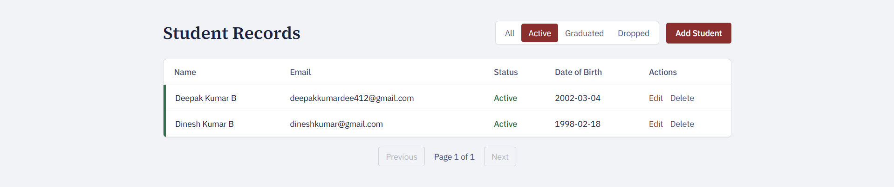
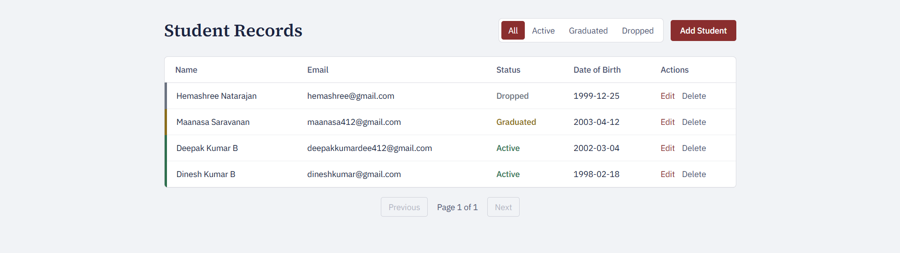
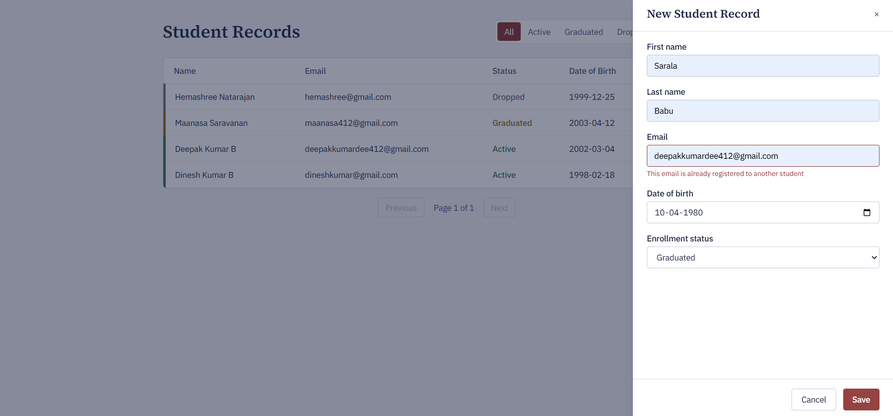
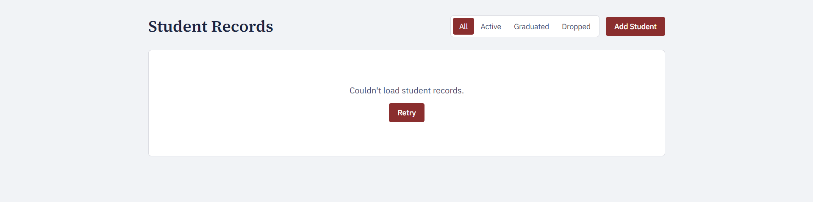
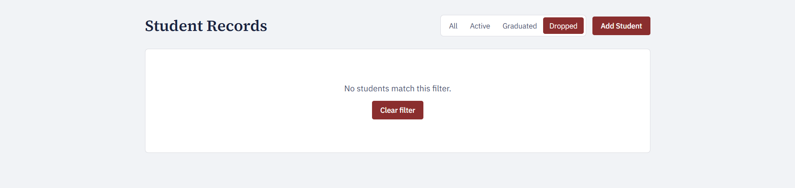

# Student Management System — MintMesh Fullstack Assignment

A CRUD application for managing student records: FastAPI backend, Vue 3 frontend.

## Setup & Run

### Backend

\`\`\`bash
cd backend
python -m venv venv
venv\Scripts\Activate.ps1 # Windows PowerShell; use source venv/bin/activate on Mac/Linux
pip install -r requirements.txt
uvicorn app.main:app --reload
\`\`\`
Runs at http://localhost:8000 — API docs at http://localhost:8000/docs

### Frontend

\`\`\`bash
cd frontend
npm install
npm run dev
\`\`\`
Runs at http://localhost:5173 (or the next available port — see Known Limitations)

### Tests

\`\`\`bash
cd backend
pytest -v
\`\`\`

## Tech Choices

- **Backend: FastAPI** — Pydantic gives request validation with minimal boilerplate, and auto-generated OpenAPI docs at `/docs` were useful for manual testing throughout.
- **Database: SQLite + SQLAlchemy** — sanctioned by the brief as sufficient for this scope; zero setup friction for the reviewer.
- **Frontend: Vue 3 (Composition API) + Vite** — chosen because it's MintMesh's stated primary stack and earns the noted bonus. My own day-to-day stack is React/Next.js, so I deliberately built this in Vue rather than defaulting to what's comfortable, to show I can pick up your primary framework rather than just my own.
- **Styling: Tailwind CSS v4** — utility-first, and v4's Vite plugin needs no separate config file.
- **Design direction**: Styled as a registrar's record system rather than a generic admin dashboard — a real data table (not a grid of cards) with enrollment status conveyed through color-coded row borders and a deliberate serif/sans type pairing, instead of default rounded cards and badge clutter.

## Known Limitations / What I'd Do Next

- No authentication/authorization — out of scope for this assignment but would be required for production
- No automated frontend tests — the brief marks these as a bonus, not required, and I prioritized backend test coverage and getting both layers working end-to-end within the time I had
- List refresh after create/edit/delete re-fetches from the API rather than updating local state optimistically — simpler and safer for this scope, at the cost of a small extra round-trip per action
- No debounced search-by-name — only the required status filter is implemented; a text search would be a natural next addition
- CORS is currently limited to a small hardcoded list of localhost ports (5173–5175) for local dev — would use an environment variable in a real deployment
- No handling for concurrent edits by multiple users (e.g. optimistic locking) — reasonable for a single-reviewer take-home, not for production

## AI Usage

Used Claude (chat) for architecture/planning and Claude Code for implementation.

**Caught mistake #1:** Claude Code initially wrote `main.py` using FastAPI's `@app.on_event("startup")` decorator, which is deprecated in current FastAPI in favor of the `lifespan` context manager. I caught this, asked for the modern pattern, and verified `/health` and `/docs` still worked identically after the change.

**Caught mistake #2:** CORS was initially hardcoded to allow only `http://localhost:5173`. Vite's dev server auto-switches to the next available port (5174, 5175...) when the default is occupied by a leftover process — which happened to me mid-build — and every API call silently failed with a CORS error until I recognized the port mismatch and broadened the allowed origins.

**Caught mistake #3:** An update endpoint used Python's `datetime.utcnow()`, which is deprecated as of Python 3.12 in favor of the timezone-aware `datetime.now(datetime.UTC)`. Caught it during review, had it fixed, and re-verified the update endpoint's behavior afterward.

## Screenshots

### List view with pagination and status filter

### Successful student creation

### Validation error (duplicate email)

### Error state (backend unavailable)

### Empty state (no matching results)

